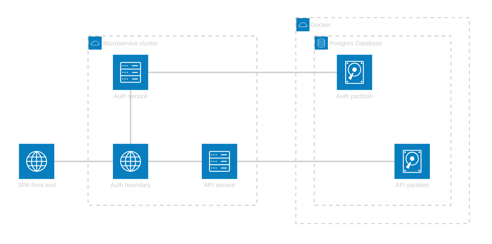
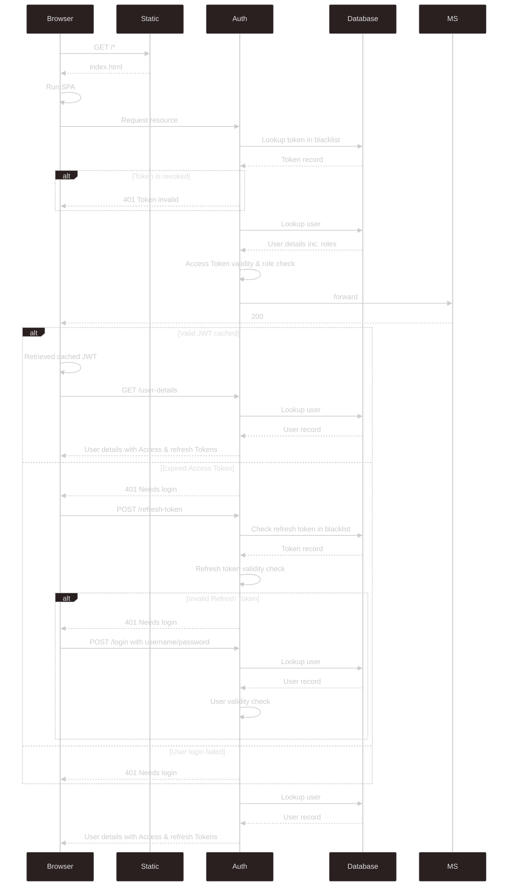
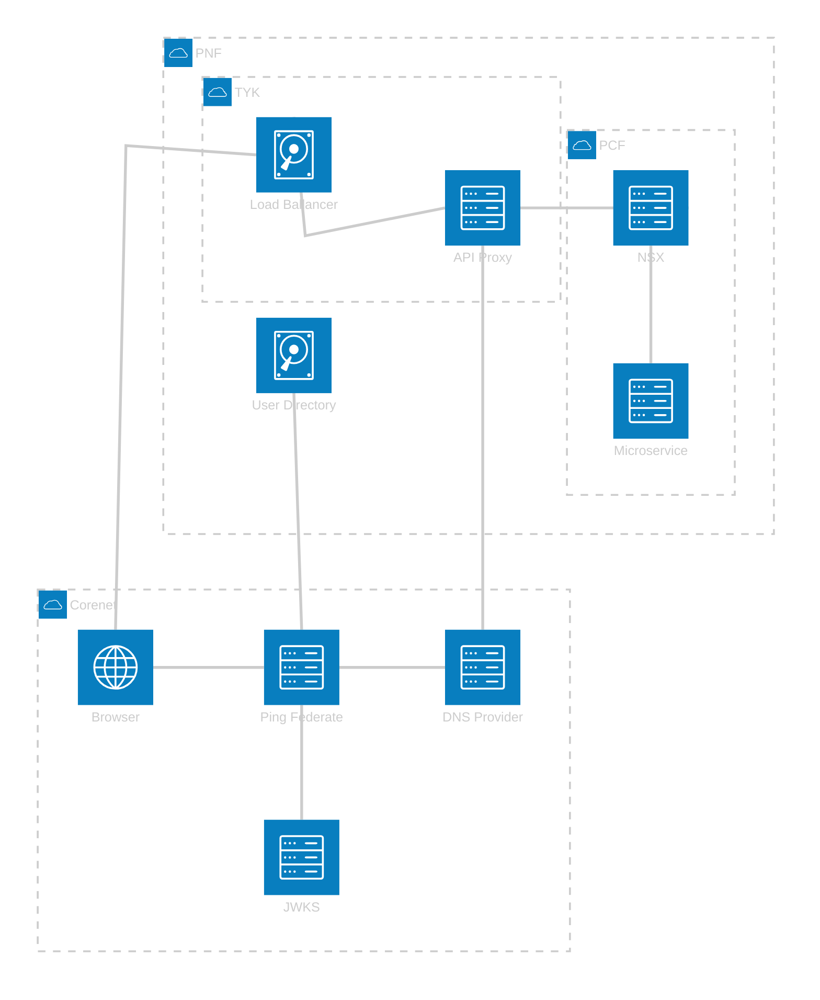

# Architecture Overview

## Application structure

```mermaid
---
config:
  theme: neo-dark
---
architecture-beta
    group docker(cloud)[Docker]

    group db(database)[Postgres Database] in docker
    service disk1(disk)[Auth partition] in db
    service disk2(disk)[API partition] in db

    group ms(cloud)[Microservice cluster]

    service auth(server)[Auth service] in ms
    service api(server)[API service] in ms

    auth:R -- L:disk1
    api:R -- L:disk2

    service user(internet)[SPA front end]

    service gateway(internet)[Auth boundary] in ms

    user:R -- L:gateway
    gateway:T -- B:auth
    gateway:R -- L:api
```

## Sequence Diagram

```mermaid
---
config:
  theme: neo-dark
---
sequenceDiagram
    Browser->>Static: GET /*
    Static-->>Browser: index.html
    Browser ->> Browser: Run SPA
    Browser->>Auth: Request resource
    Auth->>Database: Lookup token in blacklist
    Database-->>Auth: Token record

    alt Token is revoked
        Auth-->>Browser: 401 Token invalid
    end

    Auth->>Database: Lookup user
    Database-->>Auth: User details inc. roles
    Auth->>Auth: Access Token validity & role check
    Auth->>MS: forward
    MS-->>Browser: 200

    alt Valid JWT cached
        Browser->>Browser: Retrieved cached JWT
        Browser->>Auth: GET /user-details
        Auth->>Database: Lookup user
        Database-->>Auth: User record
        Auth-->>Browser: User details with Access & refresh Tokens
    else Expired Access Token
        Auth-->>Browser: 401 Needs login
        Browser->>Auth: POST /refresh-token
        Auth->>Database: Check refresh token in blacklist
        Database-->>Auth: Token record
        Auth->>Auth: Refresh token validity check
        alt Invalid Refresh Token
            Auth-->>Browser: 401 Needs login
            Browser->>Auth: POST /login with username/password
            Auth->>Database: Lookup user
            Database-->>Auth: User record
            Auth->>Auth: User validity check
        end
    else User login failed
        Auth-->>Browser: 401 Needs login
    end

    Auth->>Database: Lookup user
    Database-->>Auth: User record
    Auth-->>Browser: User details with Access & refresh Tokens
    
```

## Future State Architecture

```mermaid
---
config:
  theme: neo-dark
---
architecture-beta
    group pnf(cloud)[PNF]
    group pcf(cloud)[PCF] in pnf
    service nsx(server)[NSX] in pcf
    service ms(server)[Microservice] in pcf
    service uid(disk)[User Directory] in pnf

    group tyk(cloud)[TYK] in pnf
    service proxy(server)[API Proxy] in tyk
    service loadbal(disk)[Load Ballancer] in tyk

    group corenet(cloud)[Corenet]
    service user(internet)[Browser] in corenet
    service pf(server)[Ping Federate] in corenet
    service jwks(server)[JWKS] in corenet
    service dns(server)[DNS Provider] in corenet

    user:R -- L:pf
    user:T -- L:loadbal
    pf:B -- T:jwks
    pf:R -- L:dns
    pf:T -- B:uid
    dns:T -- B:proxy
    proxy:L -- R:nsx
    nsx:B -- T:ms
    loadbal:T -- L:proxy
```
