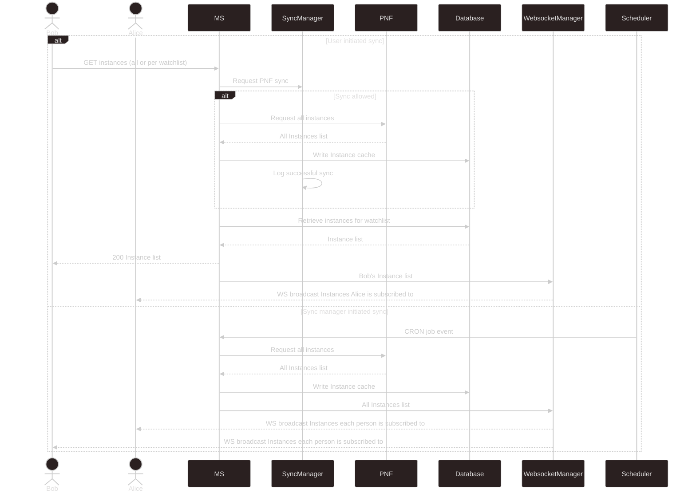

# Websocket functionality

## Sync visualised

```mermaid
---
config:
  theme: neo-dark
---
sequenceDiagram
    actor Bob
    actor Alice

    alt User initiated sync

        Bob->>MS: GET instances (all or per watchlist)
        MS->>SyncManager: Request PNF sync

        alt Sync allowed
            MS->>PNF: Request all instances
            PNF-->>MS: All Instances list
            MS->>Database: Write Instance cache
            SyncManager->>SyncManager: Log successful sync
        end

        MS->>Database: Retrieve instances for watchlist
        Database-->>MS: Instance list
        MS-->>Bob: 200 Instance list
        MS->>WebsocketManager: Bob's Instance list
        WebsocketManager-->>Alice: WS broadcast Instances Alice is subscribed to

    else Sync manager initiated sync
        Scheduler->>MS: CRON job event
        MS->>PNF: Request all instances
        PNF-->>MS: All Instances list
        MS->>Database: Write Instance cache
        MS->>WebsocketManager: All Instances list
        WebsocketManager-->>Alice: WS broadcast Instances each person is subscribed to
        WebsocketManager-->>Bob: WS broadcast Instances each person is subscribed to
    end
```
